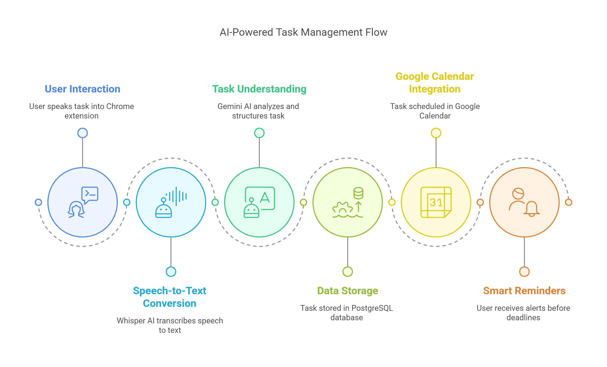

# Speech-To-Plan Reminder - Browser Extension & Web Interface 🎙️✨

Transform your spoken words into organized plans and reminders effortlessly with this powerful application! Speech-To-Plan Reminder is an innovative solution that leverages cutting-edge speech recognition and AI technology to convert voice inputs into structured task reminders and plans. With seamless Google Calendar integration, your tasks are not only recorded but automatically synced to your calendar, ensuring you never miss an important deadline or appointment.

Now available as both a Chrome extension and a web interface, giving you flexibility in how you access and use the application!

## 🔄 Project Flow



The diagram above illustrates the complete flow of the Speech-To-Plan Reminder system, showing how voice input is processed through various components to create organized tasks and calendar events.

## 🏗️ Project Structure

```
Speech-To-Plan-reminder/
├── app/                    # Python application core components
│   ├── models/            # Database models
│   ├── routes/            # API endpoints
│   ├── services/          # Business logic services
│   └── utils/             # Utility functions
├── extension/             # Chrome extension files
├── node-server/           # Node.js server implementation
│   └── server.js          # Main Node.js server file
├── web-client/            # Web interface files
│   ├── index.html         # Main HTML structure
│   ├── styles.css         # CSS styling
│   └── app.js             # Frontend JavaScript
├── main.py                # Main application entry point
├── database.py            # Database configuration
├── calendar_service.py    # Calendar integration
├── requirements.txt       # Python dependencies
├── package.json           # Node.js dependencies
└── start-servers.ps1      # Script to start both servers
```

## 🌟 Key Features

- **Voice-to-Text Conversion**: Advanced speech recognition using OpenAI Whisper
- **AI-Powered Task Analysis**: Intelligent task processing using Google's Gemini AI
- **Browser Integration**: Seamlessly works as a Chrome extension for easy access
- **Persistent Storage**: Secure PostgreSQL database for reliable data management
- **Modern Web Interface**: Intuitive UI for easy interaction
- **Google Calendar Integration**: Automatically sync tasks with due dates to your Google Calendar

## 🚀 Technologies Used

- **AI & Machine Learning**:
  - OpenAI Whisper - State-of-the-art speech recognition
  - Google Gemini AI - Advanced natural language processing
  
- **Backend**:
  - **Hybrid Architecture**:
    - Node.js - API gateway and real-time capabilities
    - FastAPI - High-performance Python web framework
  - SQLAlchemy - SQL toolkit and ORM
  - Python 3.8+
  - Google Calendar API - Calendar integration and event management

- **Browser Extension**:
  - Chrome Extension APIs
  - HTML/CSS/JavaScript
  
- **Database**:
  - PostgreSQL - Robust, reliable database system

## Prerequisites

- Python 3.8 or higher
- PostgreSQL database
- FFmpeg for audio processing
- Modern web browser (for extension)
- Google Cloud Platform account (for Calendar integration)

## Installation

1. Clone the repository:
   ```bash
   git clone https://github.com/waghib/Speech-To-Plan-reminder.git
   cd Speech-To-Plan-reminder
   ```

2. Create and activate virtual environment:
   ```bash
   python -m venv venv
   source venv/bin/activate  # On Windows: venv\Scripts\activate
   ```

3. Install Python dependencies:
   ```bash
   pip install -r requirements.txt
   ```

4. Install Node.js dependencies:
   ```bash
   cd node-server
   npm install
   cd ..
   ```

5. Set up environment variables:
   - Copy `.env.example` to `.env`
   - Configure your database and other settings

6. Initialize the database:
   ```bash
   python init_db.py
   ```

7. Set up Google Calendar Integration:
   - Go to Google Cloud Console
   - Create a new project or select an existing one
   - Enable the Google Calendar API
   - Create OAuth 2.0 credentials (Desktop application type)
   - Download the client secrets file and save it as `client_secret_[YOUR_CLIENT_ID].apps.googleusercontent.com.json` in the project root

## Running the Application

### Using the Hybrid Architecture (Node.js + Python)

1. Start both servers using the provided PowerShell script:
   ```bash
   ./start-servers.ps1
   ```
   This will start both the Python backend server (port 8000) and the Node.js server (port 3000).

2. Access the application through one of the following methods:
   - **Chrome Extension**: Load the extension from the `extension` directory
   - **Web Interface**: Open `http://localhost:3000` in your web browser

3. When adding a task with a due date, the application will:
   - Save the task in the local database
   - Create a corresponding event in your Google Calendar
   - Set up reminders (1 day and 1 hour before the event)
   - First-time users will need to authorize the application to access their Google Calendar

### Legacy Method (Python-only)

1. Start the server:
   ```bash
   uvicorn server:app --reload
   ```

2. Access the application through the browser extension

## Web Interface

The web interface provides a modern, responsive alternative to the Chrome extension, allowing users to access the Speech-To-Plan Reminder functionality directly from their browser without installing an extension.

### Web Interface Features

- **Responsive Design**: Works seamlessly on desktop and mobile devices
- **Chat Interface**: Intuitive chat-based interaction with the AI assistant
- **Voice Recording**: Record voice commands directly from your browser
- **Task Management**: View, filter, and manage your tasks
  - Toggle task completion status
  - Delete tasks you no longer need
  - Filter tasks by active/completed status
- **Real-time Updates**: Changes sync immediately across the interface

### Technical Implementation

- Built with modern HTML5, CSS3, and vanilla JavaScript
- Communicates with the Node.js server via REST APIs
- Shares the same backend functionality as the Chrome extension
- Located in the `web-client` directory of the project

## Calendar Integration Features

- **Automatic Event Creation**: Tasks with due dates are automatically added to your Google Calendar
- **Smart Date Parsing**: Understands various date formats in your voice commands
- **Customized Reminders**: Sets up helpful reminders before each task's due date
- **All-Day Events**: Tasks are created as all-day events for better visibility
- **Timezone Aware**: Properly handles your local timezone for accurate scheduling

## Contributing

Contributions are welcome! Please feel free to submit a Pull Request.

## License

This project is licensed under the MIT License - see the LICENSE file for details.

## Impact Statement

Speech-To-Plan Reminder revolutionizes the way we capture and organize our thoughts and tasks. By bridging the gap between natural speech and digital organization, it makes task management more accessible and efficient than ever before. With Google Calendar integration, it ensures your tasks are not just recorded but properly scheduled and remembered, making it an indispensable tool for anyone who wants to stay organized across multiple platforms.

---
Made with ❤️ by waghib for productivity enthusiasts everywhere
