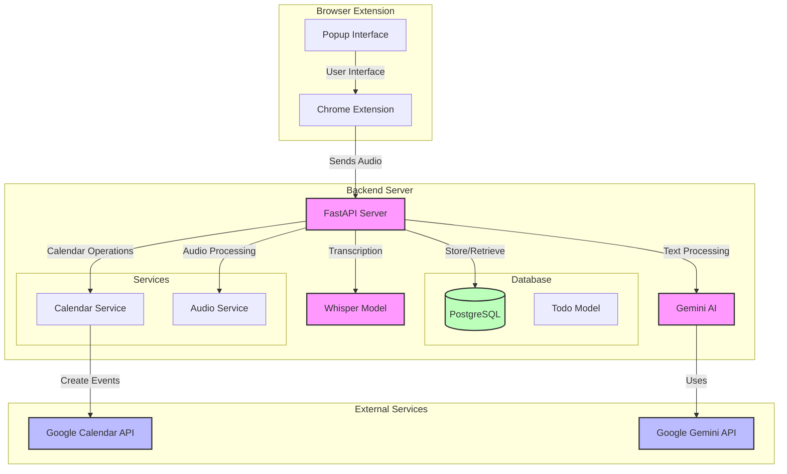

# Architecture Overview

## Components

1. **Browser Extension**
   - Chrome extension with popup interface
   - Captures audio input from user
   - Communicates with backend server

2. **Backend Server (FastAPI)**
   - Handles audio transcription using Whisper
   - Processes text using Google's Gemini AI
   - Manages todo items and calendar events
   - Provides REST API endpoints

3. **Services**
   - **Calendar Service**: Integrates with Google Calendar
   - **Audio Service**: Processes audio files in chunks

4. **Database**
   - PostgreSQL database
   - Stores todo items with due dates
   - Tracks calendar event IDs

5. **External APIs**
   - Google Calendar API for event management
   - Google Gemini API for text processing

## Data Flow
1. User speaks into the Chrome extension
2. Audio is sent to the FastAPI backend
3. Audio is transcribed using Whisper
4. Text is processed by Gemini AI to extract todo items and dates
5. Todo items are stored in PostgreSQL
6. Calendar events are created in Google Calendar
7. Results are returned to the extension

## Key Features
- Speech-to-text conversion
- Natural language processing
- Todo management
- Calendar integration
- Asynchronous audio processing
- Secure API authentication
